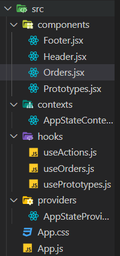

# 프로젝트 Recap

---

## 주요 폴더 구조



- components
  - Footer.jsx
  - Header.jsx
  - Orders.jsx 
    - 쇼핑몰에서 장바구니 기능을 담당하는 컴포넌트
  - Prototypes.jsx
    - 쇼핑몰 항목 리스트 컴포넌트
- contexts
  - AppStateContext.jsx
    - 전역적으로 사용할 데이터를 context로 만들기 위한 컴포넌트
- hoos
  - useActions.js
    - AppStateProviders에서 사용되는 함수를 반환하는 hook
  - useOrders.js
    - AppStateProviders에서 제공하는 장바구니 목록을 반환하는 hook
  - usePrototypes.js
    - Prototypes의 소핑몰 항목 리스트를 반환하는 hook
- providers
  - AppStateProviders.jsx
    - Context로써 제공되는 데이터

<br>

---

## Context API

> ```jsx
> // AppStateContext.jsx
> import React from "react";
> 
> const AppStateContext = React.createContext();
> 
> export default AppStateContext;
> ```
>
> Provider( 만약에 사용한다면 Consumer)로써 사용하기 위한 Context 컴포넌트.
>
> ```jsx
> // AppStateProviders.jsx
> 
> import AppStateContext from "../contexts/AppStateContext";
> import { useCallback, useState } from "react";
> 
> const AppStateProvider = ({ children }) => {
>   const [prototypes, setPrototypes] = useState([
>     {
>       id: "pp-01",
>       title: "Kids-story",
>       artist: "Thomas Buisson",
>       desc: "This prototype was made with ProtoPie, the interactive prototyping tool for all digital products.",
>       thumbnail:
>         "https://prototype-shop.s3.ap-northeast-2.amazonaws.com/thumbnails/Kids-story_1.mp4",
>       price: 10,
>       pieUrl: "https://cloud.protopie.io/p/8a6461ad85",
>     },
>     // ... 중략 ...
>   ]);
>   const [orders, setOrders] = useState([]);
>   const addToOrder = useCallback((id) => {
>     setOrders((orders) => {
>       const finded = orders.find((order) => order.id === id);
>       if (finded === undefined) {
>         return [...orders, { id, quantity: 1 }];
>       } else {
>         return orders.map((order) => {
>           if (order.id === id) {
>             return {
>               id,
>               quantity: order.quantity + 1,
>             };
>           } else {
>             return order;
>           }
>         });
>       }
>     });
>   }, []);
>   const remove = useCallback((id) => {
>     setOrders((orders) => {
>       return orders.filter((order) => order.id !== id);
>     });
>   }, []);
>   const removeAll = useCallback(() => {
>     setOrders([]);
>   }, []);
>   return (
>     <AppStateContext.Provider
>       value={{ prototypes, orders, addToOrder, remove, removeAll }}
>     >
>       {children}
>     </AppStateContext.Provider>
>   );
> };
> 
> export default AppStateProvider;
> 
> ```
>
> Context로 사용하기 위한 컴포넌트가 여기서 사용되었다. return 상단에 이 프로젝트에서 사용될 데이터나 함수 같은 것들이 정의되어 있고, 해당 데이터를 value props로 넘겨주는 컴포넌트를 return하고 있다. 그리고 export default로 외부에서 사용할 수 있도록 했다.
>
> ### AppStateProviders.jsx 변수 함수 설명
>
> - prototypes
>
>   쇼핑몰 페이지에서 상품 항목으로 사용될 데이터 모임.
>
> - orders
>
>   상품을 장바구니에 담았을 때 추가되거나, 장바구니에서 삭제되었을 때 상태를 나타낼 데이터
>
> - addToOrders
>
>   상품 리스트에서 장바구니로 추가하는 로직.
>
>   ```jsx
>     // 상품의 id값을 인자로 받는 함수. useCallback을 이용해서 함수를 재사용할 수 있도록 한다.
>     const addToOrder = useCallback((id) => {
>       //setOrders는 orders 데이터를 변경하는 메서드로 order와 함께 useState로 선언됐다.
>       setOrders((orders) => {
>         
>         //finded에는 Arrays.prototype.find 메서드를 이용해 결과값을 반환한다.
>         //id값이 일치하면 해당하는 order 항목을 반환할 것이고 없다면 undefined를 반환할 것이다.
>         const finded = orders.find((order) => order.id === id);
>           
>         //finde 값에 따라서 orders의 데이터를 다르게 변경한다.
>         //undefined. 즉, 항목이 없다면 해당 항목을 추가한다.
>         if (finded === undefined) {
>           return [...orders, { id, quantity: 1 }];
>         } else {
>         //항목이 있다면 Arrays.prototype.map 메서드를 이용해 해당 항목만 수정된 새 배열을 반환.
>           return orders.map((order) => {
>             if (order.id === id) {
>               return {
>                 id,
>                 quantity: order.quantity + 1,
>               };
>             } else {
>               return order;
>             }
>           });
>         }
>       });
>     }, []);
>   ```
>
> - remove
>
>   상품을 장바구니에서 삭제했을 때 메서드
>
>   ```jsx
>    const remove = useCallback((id) => {
>       setOrders((orders) => {
>         // 삭제되는 데이터의 id 값과 일치하지 않는 항목만 새 배열로 반환
>         return orders.filter((order) => order.id !== id);
>       });
>     }, []);
>   ```
>
> - removeAll
>
>   장바구니를 비우는 메서드

<br>

---

## 메인 컴포넌트 분석

> ### Prototypes.jsx
>
> ```jsx
> import useOrders from "../hooks/useOrders";
> import usePrototypes from "../hooks/usePrototypes";
> import useActions from "../hooks/useActions";
> import { useMemo } from "react";
> 
> export default function Orders() {
>   // custom hook을 이용해서 필요한 정보들을 가져온다.
>   const orders = useOrders();
>   const prototypes = usePrototypes();
>   const { remove, removeAll } = useActions();
>     
>   // totalPrice에 useMemo를 사용한 이유는 특정 변수가 변화할 때만 변화를 주기 위함.
>   const totalPrice = useMemo(() => {
>     return orders
>       .map((order) => {
>         const { id, quantity } = order;
>         const prototype = prototypes.find((p) => p.id === id);
>         return prototype.price * quantity;
>       })
>       .reduce((a, b) => a + b, 0);
>   // orders, prototypes에만 반응하도록 설정
>   }, [orders, prototypes]);
>   console.log(orders);
> 
>   if (orders.length === 0) {
>     return (
>       <aside>
>         <div className="empty">
>           <div className="title">You don't hav any orders</div>
>           <div className="subtitle">Click on a + to add an order</div>
>         </div>
>       </aside>
>     );
>   } else {
>     return (
>       <aside>
>         <div className="order">
>           <div className="body">
>             {orders.map((order) => {
>               const prototype = prototypes.find((p) => p.id === order.id);
>               const click = () => {
>                 remove(order.id);
>               };
>               return (
>                 <div className="item" key={order.id}>
>                   <div className="img">
>                     <video src={prototype.thumbnail} />
>                   </div>
>                   <div className="content">
>                     <p className="title">
>                       {prototype.title} x {order.quantity}
>                     </p>
>                   </div>
>                   <div className="action">
>                     <p className="price">
>                       $ {prototype.price * order.quantity}
>                     </p>
>                     <button className="btn btn--link" onClick={click}>
>                       <i className="icon icon--cross"></i>
>                     </button>
>                   </div>
>                 </div>
>               );
>             })}
>           </div>
>           <div className="total">
>             <hr />
>             <div className="item">
>               <div className="content">Total</div>
>               <div className="action">
>                 <div className="price">$ {totalPrice} </div>
>               </div>
>               <button className="btn btn--link" onClick={removeAll}>
>                 <i className="icon icon--delete"></i>
>               </button>
>             </div>
>             <button
>               className="btn btn--secondary"
>               style={{ width: "100%", marginTop: 10 }}
>             >
>               Checkout
>             </button>
>           </div>
>         </div>
>       </aside>
>     );
>   }
> }
> ```


